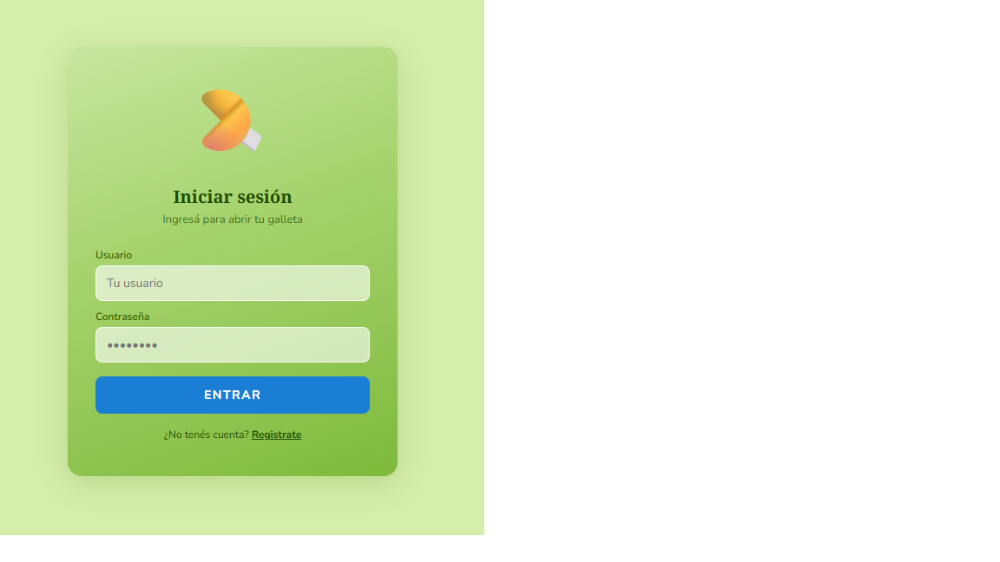
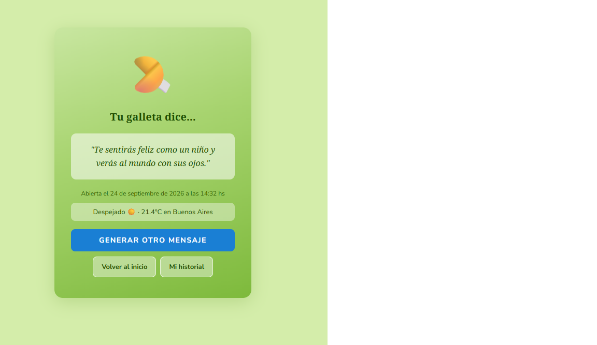
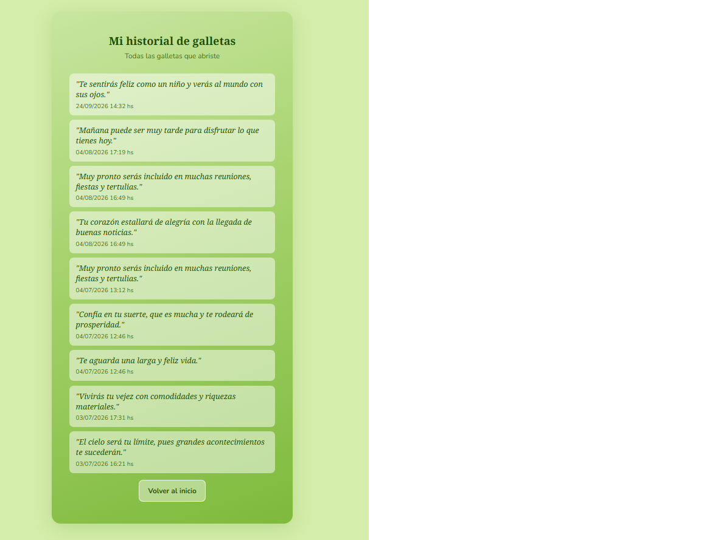
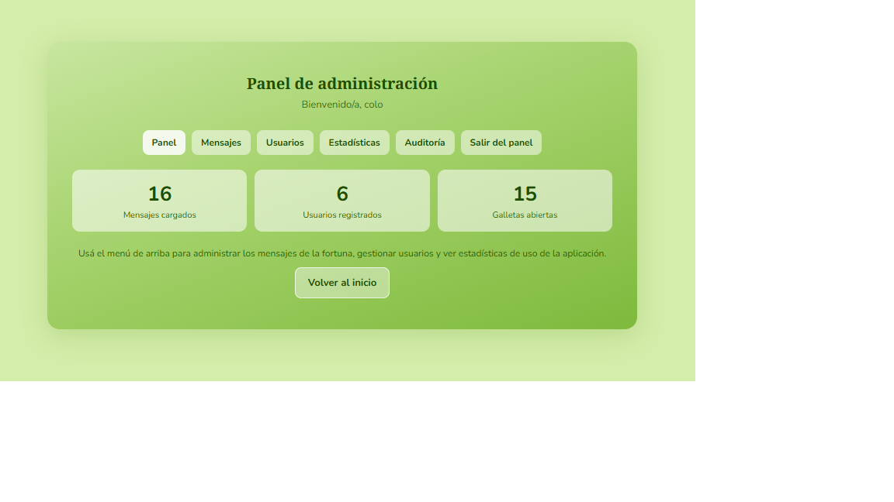
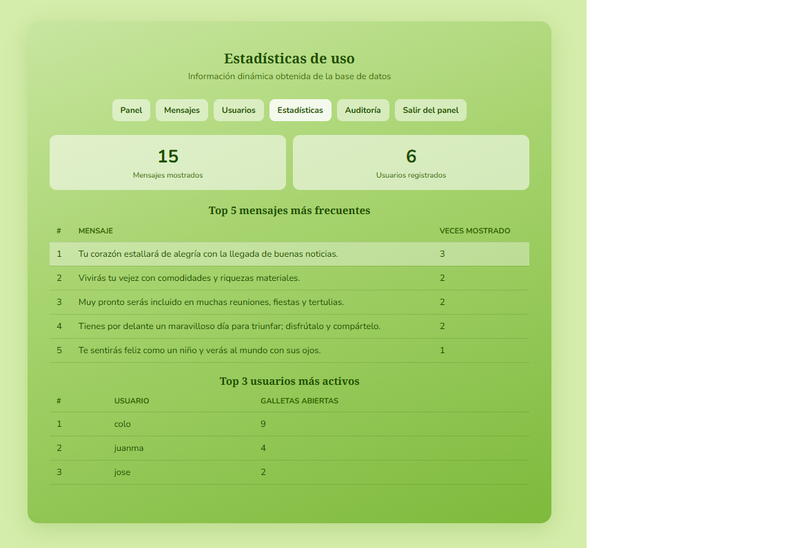
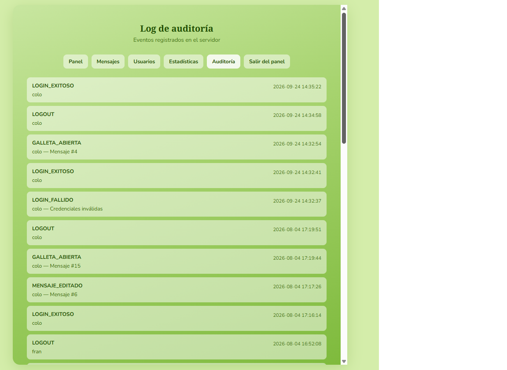
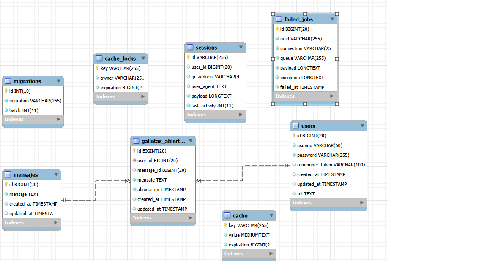

# 🥠 Galleta de la Fortuna

App web en **Laravel** donde cada usuario abre galletas de la fortuna, recibe un mensaje aleatorio y guarda su historial. Tiene un panel de administración con gestión de mensajes, usuarios, estadísticas y auditoría. Proyecto final de **Producción Web**.


### 🔗 [Ver demo en vivo](https://TU-APP.onrender.com)

> **Usuario de prueba:** `colo` · **Contraseña:** `1234`
>
> La demo está en un plan gratuito: si no se usó en un rato, la primera carga puede tardar alrededor de un minuto.

---

## ✨ Funcionalidades

### Usuarios
- 🔐 **Registro e inicio de sesión** con contraseñas hasheadas y opción "recordarme".
- 🥠 **Abrir una galleta:** muestra un mensaje aleatorio que nunca repite el último que te tocó.
- 🌤️ **Clima en vivo de Buenos Aires** junto al mensaje, consumiendo la API pública de [Open-Meteo](https://open-meteo.com/). Si la API no responde, la app sigue funcionando igual.
- 📜 **Historial paginado** con todas las galletas abiertas.

### Administración
- 🛡️ **Roles de usuario** (`usuario` / `administrador`) protegidos con un middleware propio.
- ✏️ **CRUD de mensajes** con validación.
- 👥 **Listado de usuarios** con la cantidad de galletas que abrió cada uno y su historial.
- 📊 **Estadísticas:** mensajes más frecuentes y usuarios más activos.
- 🧾 **Log de auditoría:** registra logins (exitosos y fallidos), galletas abiertas y cambios en los mensajes.

## 📸 Capturas

<!-- Reemplazá cada src por tus imágenes -->

| Login | Galleta abierta |
|:---:|:---:|
|  |  |

| Historial | Panel admin |
|:---:|:---:|
|  |  |

| Estadísticas | Auditoría |
|:---:|:---:|
|  |  |


## 🏗️ Cómo está hecho

- **MVC con Laravel:** controladores separados por responsabilidad (`AuthController`, `GalletaController`, `HistorialController`, `AdminController`).
- **Eloquent** con relaciones entre `User`, `Mensaje` y `GalletaAbierta`.
- **Middleware `EsAdmin`** que protege todas las rutas bajo `/admin`.
- **Servicio de auditoría** propio que escribe y lee un log con formato estructurado.
- **Migraciones y seeders** para levantar la base con datos de prueba en un solo comando.
- **Blade + Tailwind CSS 4**, compilado con Vite.
- **Consumo de una API externa** con el cliente HTTP de Laravel, con timeout y manejo de errores.

### Modelo de datos

| Tabla | Descripción |
|---|---|
| `users` | Usuarios con su rol |
| `mensajes` | Mensajes posibles de las galletas |
| `galletas_abiertas` | Cada galleta abierta: quién, qué mensaje y cuándo |

<!-- IMAGEN opcional: diagrama entidad-relación -->
<p align="center">
  
</p>

## 🚀 Cómo correrlo en local

### Requisitos
- PHP 8.3+
- Composer
- Node.js 20+
- MySQL 8

### Pasos

```bash
# 1. Clonar el repo
git clone https://github.com/Coleko22/Galleta-de-la-fortuna-Produccion-Web
cd TU_REPO

# 2. Instalar dependencias
composer install
npm install

# 3. Configurar el entorno
cp .env.example .env
php artisan key:generate
```

Creá una base de datos vacía en MySQL y completá los datos en el `.env`:

```env
DB_DATABASE=galletamensajes
DB_USERNAME=colo
DB_PASSWORD=1234
```

```bash
# 4. Crear las tablas y cargar datos de prueba
php artisan migrate --seed

# 5. Levantar el servidor (Laravel + Vite)
composer run dev
```


## 📁 Estructura

```
app/
├── Http/
│   ├── Controllers/     # Auth, Galleta, Historial, Admin
│   └── Middleware/      # EsAdmin
├── Models/              # User, Mensaje, GalletaAbierta
└── Services/            # Auditoria
database/
├── migrations/
└── seeders/             # Mensajes y usuarios de prueba
resources/views/
├── auth/                # Login y registro
├── galleta/             # Abrir galleta y ver mensaje
├── historial/
└── admin/               # Dashboard, mensajes, usuarios, estadísticas, auditoría
routes/web.php
```

<p align="center">Proyecto académico · Producción Web</p>
